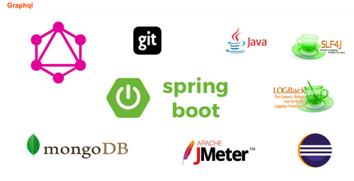

# Graphql + Spring Boot + MongoDB 


## Stack tecnológico:





## Frameworks utilizados:

- [Graphql para java](https://github.com/graphql-java/graphql-java)
- [Graphql-apigen] (https://github.com/Distelli/graphql-apigen) 
- [Graphql-Spring-Boot](https://github.com/graphql-java/graphql-spring-boot)


## Requisitos

Java 1.8
Maven 3.x
MongoDB 3.X


## Configuración

Fichero application.yml 

```
spring:
      application:
               name: poc-graphql-app
      data:
          mongodb:
            uri: mongodb://localhost/cars # Configuracion a la mongo
server:
      port: 8080

populate:
      active: true # Carga de datos inicial para pruebas data/mongo_model.js
      
graphql:
      servlet:
               mapping: /graphql
               enabled: true
               corsEnabled: true

      spring-graphql-common:
               clientMutationIdName: clientMutationId
               injectClientMutationId: true
               allowEmptyClientMutationId: false
               mutationInputArgumentName: input
               outputObjectNamePrefix: Payload
               inputObjectNamePrefix: Input
               schemaMutationObjectName: Mutation      
```


## Construcción

```
mvn clean compile
```

## Ejecución

```
java -jar target/poc-graphql-api-gen-fat.jar 
o
sh build_and_run.sh
```


## Esquema

Accede tu mismo al [editor de consultas](http://localhost:8080/) del proyecto una vez arrancado


```graphql
# Coche
type Car @java(package:"com.paradigma.graphql.schema.car.car") {
    id: String! # ! significa obligatorio
    model: Model!
    color: String
    
}

# Root query
type QueryRoot @java(package:"com.paradigma.graphql.schema.car.root.query") {
    cars: [Car] # Listado de los coches
    car(id: String!): Car # Coche por id 
    models(id: String): [Model] # Listado de los modelos
    model(id: String!): Model # Model por id 
    brands(id: String): [Brand] # Listado de las marcas
    brand(id: String!): Brand # Marca por id 
}

# Modelo
type Model @java(package:"com.paradigma.graphql.schema.car.model") {
    id: String!
    name: String
    brand: Brand!
    year: Int
}

# Modelo
type ModelQuery @java(package:"com.paradigma.graphql.schema.car.model") {
    models(id: String): [Model] # Listado de los modelos
    model(id: String!): Model # Model por id 
}


# Brand
type BrandQuery @java(package:"com.paradigma.graphql.schema.car.brand") {
    brands(id: String): [Brand] # Listado de las marcas
    brand(id: String!): Brand # Marca por id 
}


# Marca
type Brand @java(package:"com.paradigma.graphql.schema.car.brand") {
    id: String!
    name: String
}

# Objeto de entrada para agrupar las propiedades de un coche y crearlo
input InputCreateCar @java(package:"com.paradigma.graphql.schema.car.car.create") {
    modelId: String!
    color: String!
}

# Operaciones sobre los coches:
type MutateCars @java(package:"com.paradigma.graphql.schema.car.car") {
     createCar(car:InputCreateCar): Car
     deleteCar(id: String!): String
}


```

Ejemplos de consultas y mutaciones:

```graphql

{
  cars {
    id
  }
}

```

```graphql

mutation {
  createCar(car: {modelId: "593ebb10674d4c0bef6c4c2a", color: "Green"}) {
    id
    model{
      id
    }
    color
  }
 
}

```


```graphql

 {
  cars {
    id
    color
    model {
      id
      name
    }
  }
 
  models{
    id
  }
  
  car(id: "_id_que_corresponda_"){
    id
  }
}

```

...


